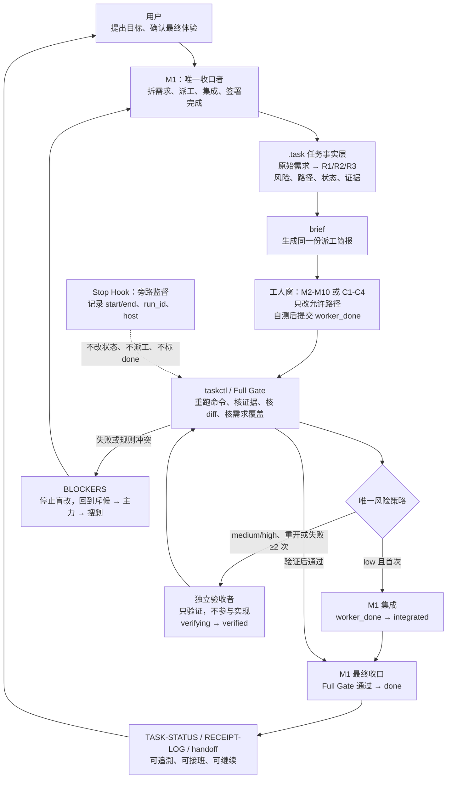

# Multi-Window M

> 长期 AI 项目的协作流程：**并行执行、可重跑验收、唯一收口。**

`Multi-Window M` 把彼此隔离的 Agent 聊天窗口，变成一个可以持续推进、验证、交接和恢复的项目流程。

它不是为了“开更多 Agent”。它解决的是长期项目里最危险的问题：工人说完成了，主窗口也相信了，最后只能由用户人工发现遗漏。

## 你最终得到什么

- **并行，但不混乱**：长期模块由常驻 M 窗维护，短任务由临时 C 窗处理；每个任务都有明确路径边界。
- **完成必须有证据**：工人交付磁盘文件和可运行的验收命令；M1 必须在自己的窗口重跑。
- **风险匹配流程**：低风险首次任务走短路径；高风险、重开或多次失败任务必须独立验收。
- **可恢复、可交接**：任务状态、原始需求映射、验证记录和下一步都在项目里，不依赖某个聊天窗口的记忆。
- **自动化不越权**：Hook 记录“检查是否被触发”，子代理可以加速；两者都不能替 M1 标记 `done`。

## 为什么需要它

| 普通多窗口协作的常见问题 | Multi-Window M 的做法 |
|---|---|
| 工人只回复“已完成” | 必须交文件、证据与可重跑命令 |
| 主窗口忙碌或偷懒，直接放行 | M1 本窗重跑 Full Gate 后才能收口 |
| 小任务与高风险任务一刀切 | 风险策略自动选择短路径或独立验收 |
| 不同窗口聊天记录互相不可见 | `brief` 生成派工简报，`handoff` 生成接班简报 |
| Registry、日志和任务状态互相打架 | `.task/` 是唯一状态源；状态文档由脚本再生 |
| Hook 看似运行，无法证明 | 记录 `run_id`、宿主、来源与 start/end 成对日志 |
| 多 Agent 同时改同一文件 | `allowed_paths`、子代理绑定与并发检查阻止越权 |

## 正常如何运作



这张图的关键不是流程更长，而是把四件事拆开：**实现、验收、收口、监督**。没有一个 Agent 可以同时单方面决定“我做完了，而且项目也完成了”。

## 角色不是一堆部门

Multi-Window M 使用的是四种不同维度；它们不能混为一谈。

| 维度 | 单位 | 为什么存在 | 做什么 |
|---|---|---|---|
| 空间 / 责任边界 | M1、M2-M10、C1-C4 | 让长期模块稳定归属、短任务及时关闭 | M1 收口；常驻 M 维护长期模块；临时 C 完成短任务 |
| 工作阶段 | 斥候、主力、搜剿 | 防止“没调查就盲改”或“实现者自己给自己放行” | 调查 → 实现 → 挑错 |
| 权限身份 | worker、verifier、M1 | 把实现权、验收权、收口权分开 | worker 提交实现；verifier 独立验证；M1 集成并标 `done` |
| 自动化组件 | `taskctl.py`、Hook、子代理 | 提高可靠性和效率，但不夺走决策权 | 脚本裁决；Hook 记账；子代理加速已有任务 |

**M1 不是“最强工人”，而是唯一负责确认项目事实的人。**

**verifier 不是常设部门，而是在策略要求时出现的独立检查身份。**

**斥候 / 主力 / 搜剿不是新窗口，而是同一窗口在不同阶段的工作方式。**

## 两条合法收口路径

所有任务都要过最低门禁；差别只在是否需要独立验收。

```text
低风险、attempt < 2：
pending → in_progress → worker_done → integrated → done

中高风险、人工重开、attempt ≥ 2，或明确要求独立验收：
pending → in_progress → worker_done → verifying → verified → integrated → done
```

策略由 `taskctl.py` 的 `verification_policy()` 唯一决定。若风险、重试次数或 manifest 自相矛盾，流程停止并输出 `POLICY_CONFLICT`，不会让用户临时在两套规则之间选择。

## 适用场景

非常适合：

- 持续数天、数周或更久的 AI 辅助开发项目；
- 多个聊天窗口或 Agent 彼此隔离、不能可靠共享上下文的环境；
- 代码、配置、数据、文档等有明确文件边界的项目；
- 需求会追加、任务会重开、需要换 Agent 或隔几天接着做的项目；
- 想并行推进，但不能接受“看起来完成、实际漏做”的项目。

不适合：

- 只修改一两行、一次对话即可完成的小任务；
- 无法定义验收标准、完全依赖主观审美的工作；
- 希望无人监督地自动产出并直接上线的生产流水线；
- 只追求速度、完全不在意证据、交接和验收成本的任务。

## 快速开始

### 1. 安装隔离副本

升级测试时保留带版本号的独立目录，避免覆盖正在使用的版本：

| 宿主 | 建议目录 | 调用 |
|---|---|---|
| Cursor | `~/.cursor/skills/multi-window_M-0.32/` | `/multi-window_M-0.32` |
| Codex | `~/.codex/skills/multi-window_M-0.32/` | `/multi-window_M-0.32` |

仓库目录始终为 `multi-window_M`；当前版本以 [`SKILL.md`](SKILL.md) 的 `version` 字段为准。

### 2. 选择协作方式

- 默认是 **P：人工路由多窗口**。用户负责开 M/C 窗并把查收信号送回 M1。
- 只有本窗实际确认可收回子代理结果后，才可使用 **A：M1 子代理半自动协作**。
- 无论哪种方式，M1 本窗重跑、风险策略和最终收口纪律都不改变。

### 3. 让 M1 建立任务事实

M1 将原始需求映射到 `source_refs` 与 R 项，声明 `allowed_paths`、风险和验收方法；再用 `brief` 生成派工简报，而不是靠手写转述。

```text
py -3 scripts/taskctl.py --root <项目根> brief TASK-001 --role worker
```

### 4. 工人执行，M1 查收

工人只在允许路径内实现并跑自测；用户或已确认的协作能力把“已完成，请查收”送回 M1。M1 重跑验收命令和 Full Gate，然后使用 `transition` 按合法路径收口。

```text
py -3 scripts/taskctl.py --root <项目根> audit-round
py -3 scripts/taskctl.py --root <项目根> transition TASK-001 integrated --actor M1
py -3 scripts/taskctl.py --root <项目根> transition TASK-001 done --actor M1
```

中高风险、重开或重复失败任务必须先经过 verifier 的 `verifying → verified`。

### 5. 交接或恢复时，不靠聊天记忆

```text
py -3 scripts/taskctl.py --root <项目根> handoff
py -3 scripts/taskctl.py --root <项目根> status --markdown --write
```

新 M1 先读生成的接班简报；`docs/TASK-STATUS.md` 由 `.task/` 再生，禁止手改。

## 门禁、Hook 与子代理的边界

- **Full Gate**：重跑可识别的验收命令、检查 evidence 路径，并在 Git 项目中核对实际改动是否越界。
- **Hook**：只记录某次 Stop 是否触发检查。它不派工、不改状态、不标 `done`。
- **子代理**：只加速现有 M/C 任务，必须绑定任务、窗口、路径和 `run_id`；不能同时做工人和独立验收者。
- **用户实测**：仍不可替代。门禁证明“声明的需求与证据通过”，用户确认产品是否真正符合意图。

Hook 接线及宿主能力确认见 [`references/hooks.md`](references/hooks.md)。任务 schema、G0-G3、状态迁移和失败 token 见 [`references/task-gate.md`](references/task-gate.md)。

## 旧项目迁移

升级旧项目时，先备份、写迁移报告与版本 lock，再检查迁移健康状态；未出现 `MIGRATE_READY` 前不要继续开发新功能。

```text
py -3 <本技能目录>\scripts\taskctl.py --root <项目根> migrate-project --destination scripts/taskctl.py --force
py -3 <本技能目录>\scripts\taskctl.py --root <项目根> migrate-project --check
```

`--root` 必须放在子命令前面。

## 自检与仓库结构

```text
py -3 scripts/taskctl.py selftest
```

| 路径 | 用途 |
|---|---|
| [`SKILL.md`](SKILL.md) | 当前工作规则 |
| [`CHANGELOG.md`](CHANGELOG.md) | 历史版本记录；不参与当前决策 |
| [`templates.md`](templates.md) | 可直接复制的开场、派工与交接话术 |
| [`scripts/taskctl.py`](scripts/taskctl.py) | 门禁、状态迁移、简报、接班与迁移工具 |
| [`scripts/`](scripts/) | 正向与负向自检 |
| [`references/task-gate.md`](references/task-gate.md) | G0-G3、schema、状态机与策略表 |
| [`references/hooks.md`](references/hooks.md) | Codex、Cursor、Zcode 的 Hook 接线 |
| [`testdata/`](testdata/) | 沙盒与测试记录 |

## 当前版本与边界

当前版本：**0.32**。它统一了窗口身份表述，并保留了需求覆盖、状态单一来源、Hook 证据、子代理边界和迁移治理。

Multi-Window M 不承诺“Agent 永远不会出错”。它承诺的是：错误不应轻易被伪装成完成；每个 `done` 都应能回到需求、文件、命令和验收记录重新检查。

## 许可证与隐私

不要提交含密钥的 `.env`、Hook 诊断日志或 `.task/hook-runs.jsonl`。这些日志已在 [`.gitignore`](.gitignore) 中忽略。
